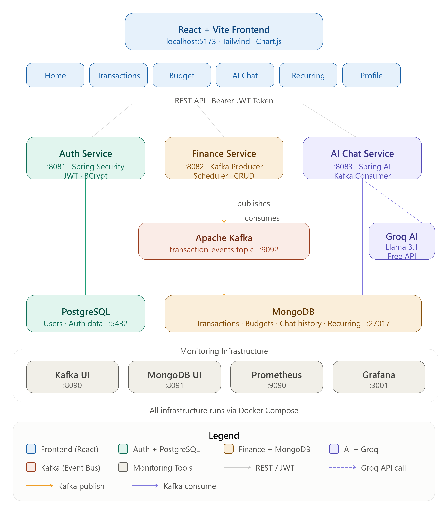

# 💰 FinanceAI — AI-Powered Personal Finance Assistant


> A full-stack, AI-powered personal finance management application built with Java Spring Boot microservices, Apache Kafka, Spring AI (Groq), and React. Manage your income, expenses, budgets, and get real-time AI-powered financial insights — all in one place.

---

## 📸 Screenshots

### 🏠 Home — Personalized Greeting
> Dynamic greeting based on time of day (Morning/Afternoon/Evening/Working Late) with monthly financial overview, expense donut chart, recent transactions, and 6-month trend line chart.

### 💸 Transactions
> Add, edit, delete, search, and filter transactions. Export to CSV. Each transaction is published to Kafka and consumed by the AI Chat Service in real time.

### 🤖 AI Chat
> Chat with Groq AI about your finances. AI reads your actual transaction data and gives personalized advice. Includes monthly report generation, quick question chips, typing animation, and chat history.

### 🎯 Budget Tracker
> Set monthly budgets per category. Visual progress bars with color-coded alerts (green/yellow/red). Budget alert popups when spending exceeds 80%.

### 🔄 Recurring Transactions
> Mark transactions as recurring (Netflix, Rent, EMI, Salary). Auto-added every month on the configured day via Spring Scheduler.

---

## 🏗️ Architecture



---

## 🛠️ Tech Stack

### Backend
| Layer | Technology |
|---|---|
| Language | Java 17 |
| Framework | Spring Boot 3.2.5 |
| AI Integration | Spring AI 1.0.0 + Groq API (Llama 3.1) |
| Messaging | Apache Kafka |
| Security | Spring Security + JWT (JJWT 0.11.5) |
| ORM | Spring Data JPA + Hibernate |
| NoSQL | Spring Data MongoDB |
| Scheduler | Spring @Scheduled |
| Build | Maven (Multi-module) |

### Frontend
| Layer | Technology |
|---|---|
| Framework | React 18 + Vite |
| Styling | Tailwind CSS 3 |
| Routing | React Router DOM v6 |
| HTTP Client | Axios |
| Charts | Chart.js + react-chartjs-2 |
| State | React Context API + useState |

### Infrastructure
| Service | Technology |
|---|---|
| Message Broker | Apache Kafka + Zookeeper |
| Relational DB | PostgreSQL 16 |
| NoSQL DB | MongoDB 7.0 |
| Monitoring | Prometheus + Grafana |
| Containerization | Docker + Docker Compose |

---

## 📁 Project Structure

```
ai-finance-assistant/
├── auth-service/                    # JWT Authentication Service
│   └── src/main/java/com/finance/auth/
│       ├── config/SecurityConfig.java
│       ├── controller/AuthController.java
│       ├── dto/                     # Request/Response DTOs
│       ├── entity/User.java         # PostgreSQL User entity
│       ├── repository/UserRepository.java
│       ├── security/               # JWT Filter + Util
│       └── service/AuthService.java
│
├── finance-service/                 # Core Finance Service
│   └── src/main/java/com/finance/core/
│       ├── config/SecurityConfig.java
│       ├── controller/FinanceController.java
│       ├── dto/                     # Transaction/Budget DTOs
│       ├── entity/                  # MongoDB entities
│       ├── kafka/TransactionProducer.java
│       ├── repository/
│       └── service/
│           ├── FinanceService.java
│           └── RecurringScheduler.java
│
├── ai-chat-service/                 # Spring AI Chat Service
│   └── src/main/java/com/finance/ai/
│       ├── config/                  # AI + Kafka config
│       ├── controller/AiChatController.java
│       ├── dto/
│       ├── entity/                  # ChatMessage + TransactionContext
│       ├── kafka/TransactionConsumer.java
│       ├── repository/
│       └── service/AiChatService.java
│
├── frontend/                        # React Frontend
│   └── src/
│       ├── components/
│       │   ├── Navbar.jsx
│       │   └── BudgetAlert.jsx
│       ├── context/AuthContext.jsx
│       ├── pages/
│       │   ├── Dashboard.jsx        # Home with greeting
│       │   ├── Transactions.jsx     # CRUD + CSV export
│       │   ├── Budget.jsx           # Budget tracker
│       │   ├── AiChat.jsx          # AI chat + monthly report
│       │   ├── Recurring.jsx        # Recurring transactions
│       │   └── Profile.jsx
│       └── services/               # API service layer
│
├── docker-compose.yml               # All infrastructure
└── prometheus.yml                   # Monitoring config
```

---

## 🔄 How It Works

### 1. Authentication Flow
```
User registers/logs in
→ Auth Service validates credentials
→ Generates JWT token (expires in 24hrs)
→ React stores token in sessionStorage
→ Every request sends Bearer token
→ Finance/Chat Services validate JWT
→ Extract userId from token
```

### 2. Transaction + Kafka Flow
```
User adds transaction (React)
→ Finance Service saves to MongoDB
→ Kafka Producer publishes to "transaction-events" topic
→ AI Chat Service Kafka Consumer receives event
→ Saves to TransactionContext collection
→ AI now has real-time transaction data for context
```

### 3. AI Chat Flow (RAG Pattern)
```
User asks: "How much did I spend on Food?"
→ AI Chat Service fetches all user transactions
→ Builds context: "Total Expense ₹3,699 | Zomato ₹850..."
→ Sends context + question to Groq API (Llama 3.1)
→ Groq responds with personalized advice
→ Saves chat history to MongoDB
→ Returns response to React UI
```

### 4. Recurring Transactions Flow
```
User creates recurring transaction (e.g., Netflix ₹649 on 28th)
→ Saved to RecurringTransaction collection
→ Spring Scheduler runs daily at 9:00 AM
→ Checks dayOfMonth matches today
→ Auto-creates transaction + publishes to Kafka
→ AI Chat Service receives event
```

---

## 🚀 Getting Started

### Prerequisites
- Java 17+
- Node.js 18+
- Docker Desktop
- Maven 3.9+

### 1. Clone the Repository
```bash
git clone https://github.com/your-username/ai-finance-assistant.git
cd ai-finance-assistant
```

### 2. Start Infrastructure (Docker)
```bash
docker compose up -d
```

This starts:
- Apache Kafka + Zookeeper (port 9092)
- MongoDB (port 27017)
- PostgreSQL (port 5432)
- Kafka UI (http://localhost:8090)
- MongoDB Express (http://localhost:8091)
- Grafana (http://localhost:3001)
- Prometheus (http://localhost:9090)

### 3. Configure Environment Variables

Create `ai-chat-service/.env`:
```env
GROQ_API_KEY=gsk_your_groq_api_key_here
```

Get your free Groq API key at: https://console.groq.com

### 4. Start Backend Services

Start each service in IntelliJ or via Maven:

```bash
# Auth Service (port 8081)
cd auth-service && mvn spring-boot:run

# Finance Service (port 8082)
cd finance-service && mvn spring-boot:run

# AI Chat Service (port 8083)
cd ai-chat-service && mvn spring-boot:run -Dspring-boot.run.jvmArguments="-Duser.timezone=Asia/Kolkata"
```

### 5. Start Frontend
```bash
cd frontend
npm install
npm run dev
```

Open: http://localhost:5173

---

## 🌐 API Endpoints

### Auth Service (port 8081)
| Method | Endpoint | Description | Auth |
|---|---|---|---|
| POST | `/api/auth/register` | Register new user | ❌ |
| POST | `/api/auth/login` | Login + get JWT | ❌ |
| GET | `/api/auth/health` | Health check | ❌ |

### Finance Service (port 8082)
| Method | Endpoint | Description | Auth |
|---|---|---|---|
| POST | `/api/finance/transactions` | Add transaction | ✅ |
| GET | `/api/finance/transactions` | Get all transactions | ✅ |
| PUT | `/api/finance/transactions/:id` | Update transaction | ✅ |
| DELETE | `/api/finance/transactions/:id` | Delete transaction | ✅ |
| GET | `/api/finance/summary` | Monthly summary | ✅ |
| POST | `/api/finance/budgets` | Create budget | ✅ |
| GET | `/api/finance/budgets` | Get budgets | ✅ |
| POST | `/api/finance/recurring` | Create recurring | ✅ |
| GET | `/api/finance/recurring` | Get recurring | ✅ |
| DELETE | `/api/finance/recurring/:id` | Delete recurring | ✅ |

### AI Chat Service (port 8083)
| Method | Endpoint | Description | Auth |
|---|---|---|---|
| POST | `/api/chat/message` | Send message to AI | ✅ |
| GET | `/api/chat/history` | Get chat history | ✅ |
| DELETE | `/api/chat/history` | Clear chat history | ✅ |

---

## ✨ Features

### 🏠 Home Dashboard
- Personalized time-based greeting (Morning/Afternoon/Evening/Working Late/Burning Midnight Oil)
- First-time vs returning user detection
- Monthly financial summary cards
- Expense breakdown donut chart
- 6-month income vs expense trend line chart
- Recent transactions list

### 💸 Transactions
- Add, edit, delete transactions
- Search by title or category
- Filter by type (Income/Expense) and category
- Export to CSV
- Real-time Kafka event publishing

### 🤖 AI Chat (Powered by Groq + Llama 3.1)
- Real-time financial advice based on actual data
- Monthly financial report generation
- Quick question chips
- Typing animation
- Chat history persistence
- Clear chat history

### 🎯 Budget Tracker
- Set monthly limits per category
- Visual progress bars (green/yellow/red)
- Budget alert popups at 80% and 100%
- Dismissible notifications

### 🔄 Recurring Transactions
- Set up recurring monthly transactions
- Configure day of month
- Auto-added via Spring Scheduler
- Active/inactive management

### 👤 Profile
- User details view
- Account status

### 📱 Mobile Responsive
- Hamburger menu on mobile
- Bottom navigation bar
- Responsive grid layouts
- Touch-friendly buttons

### 🔐 Security
- JWT-based authentication
- BCrypt password hashing
- Token extracted server-side (no client-side userId spoofing)
- Session-based storage (clears on browser close)

---

## 🏦 Infrastructure URLs

| Service | URL | Credentials |
|---|---|---|
| React App | http://localhost:5173 | — |
| Auth Service | http://localhost:8081 | — |
| Finance Service | http://localhost:8082 | — |
| AI Chat Service | http://localhost:8083 | — |
| Kafka UI | http://localhost:8090 | — |
| MongoDB Express | http://localhost:8091 | admin/password |
| Grafana | http://localhost:3001 | admin/admin |
| Prometheus | http://localhost:9090 | — |

---

## 🔧 Environment Variables

### AI Chat Service (`ai-chat-service/.env`)
```env
GROQ_API_KEY=gsk_xxxxxxxxxxxxxxxxxxxx
```

### Application Properties
| Service | Port | Database |
|---|---|---|
| auth-service | 8081 | PostgreSQL (authdb) |
| finance-service | 8082 | MongoDB (financedb) |
| ai-chat-service | 8083 | MongoDB (chatdb) |

---

## 📊 Monitoring

### Grafana (http://localhost:3001)
- Login: admin/admin
- Add Prometheus data source: http://prometheus:9090
- Import Spring Boot dashboard

### Prometheus (http://localhost:9090)
- Scrapes metrics from all 3 Spring Boot services
- Endpoints exposed via Spring Actuator

### Kafka UI (http://localhost:8090)
- View `transaction-events` topic
- Monitor consumer groups
- View message payloads

---

## 🤝 Contributing

1. Fork the repository
2. Create a feature branch: `git checkout -b feature/your-feature`
3. Commit: `git commit -m "feat: add your feature"`
4. Push: `git push origin feature/your-feature`
5. Open a Pull Request

---

## 📄 License

This project is licensed under the MIT License.

---

## 👨‍💻 Author

**Shubham Gangurde**
- Consultant | Software Engineer II @ Deloitte
- Java Spring Boot Developer | 4+ Years Experience
- Certified: SnowPro Advanced Data Engineer, SnowPro Core, AZ-900

---

## 🙏 Acknowledgements

- [Spring AI](https://spring.io/projects/spring-ai) — AI integration
- [Groq](https://groq.com) — Free Llama 3.1 API
- [Apache Kafka](https://kafka.apache.org) — Event streaming
- [Confluent](https://confluent.io) — Kafka Docker images
- [Tailwind CSS](https://tailwindcss.com) — UI styling
- [Chart.js](https://chartjs.org) — Data visualization
